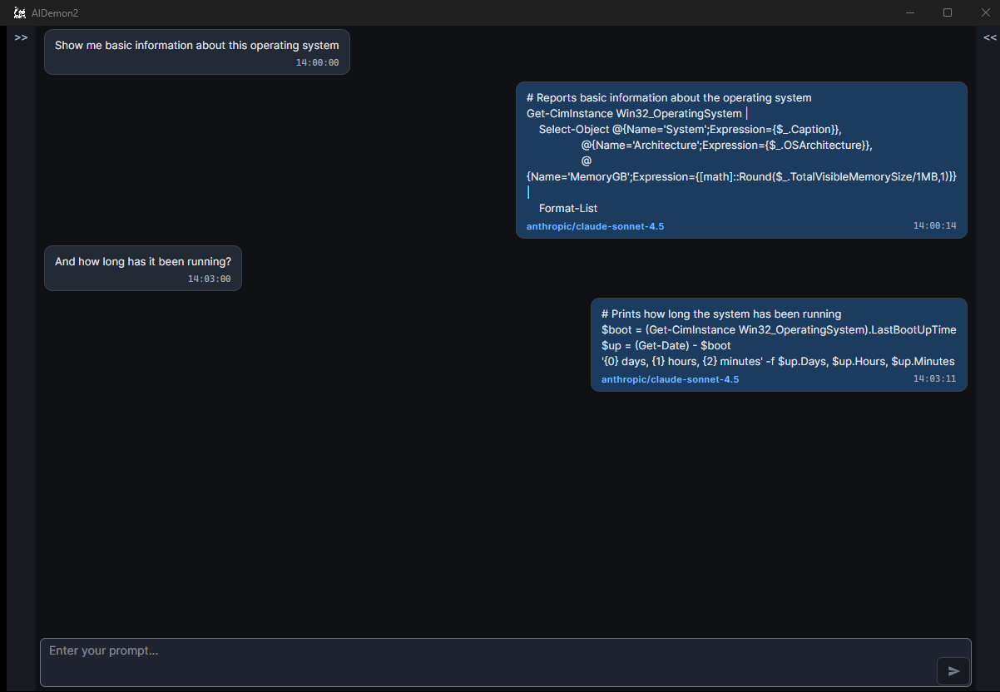
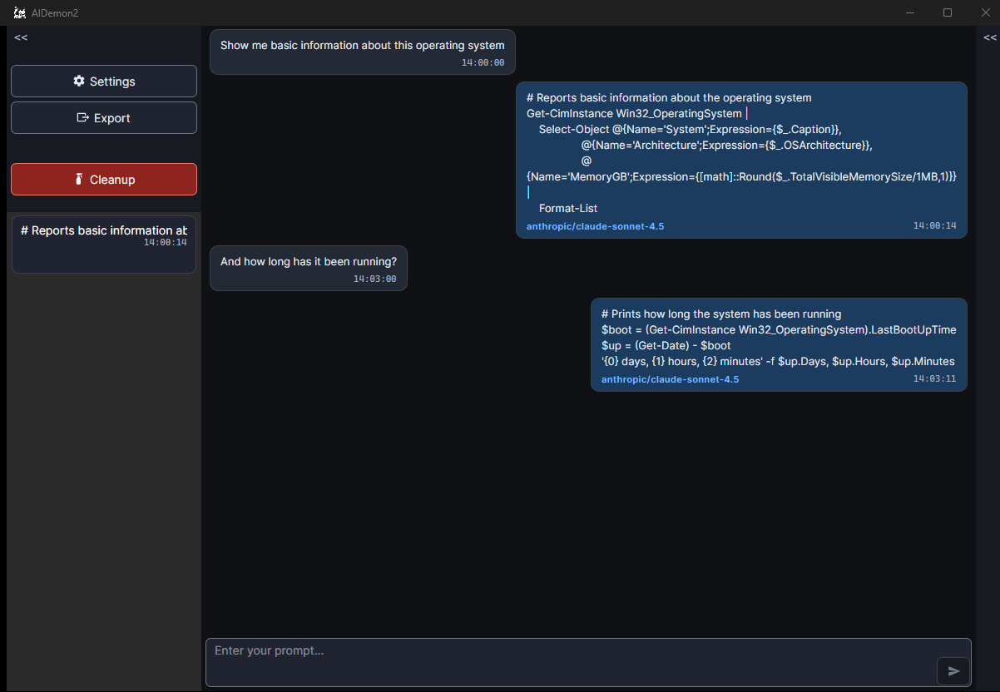
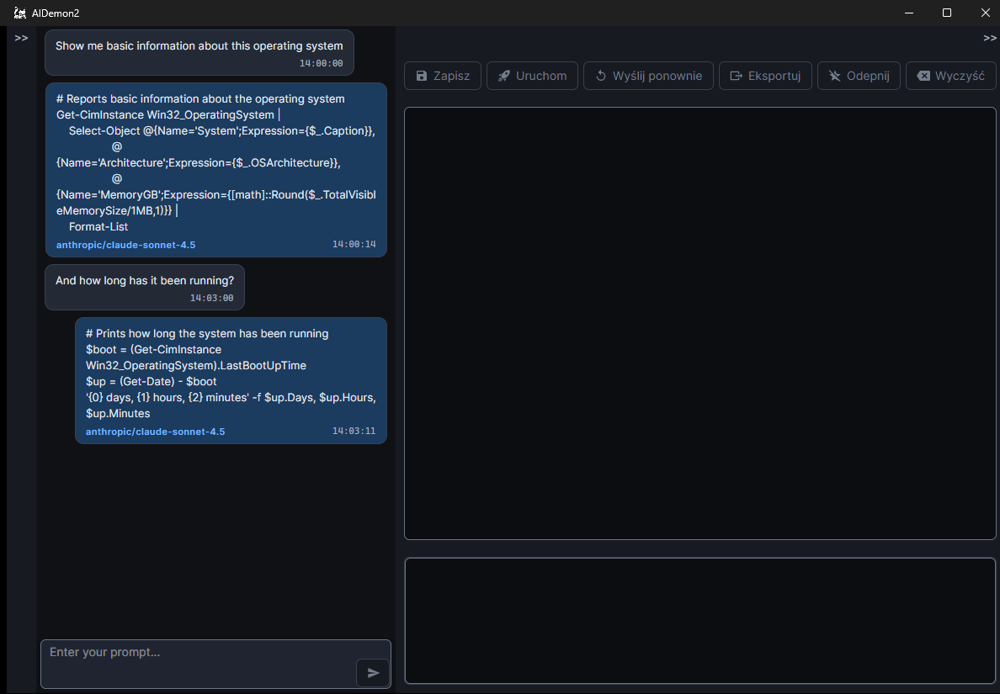
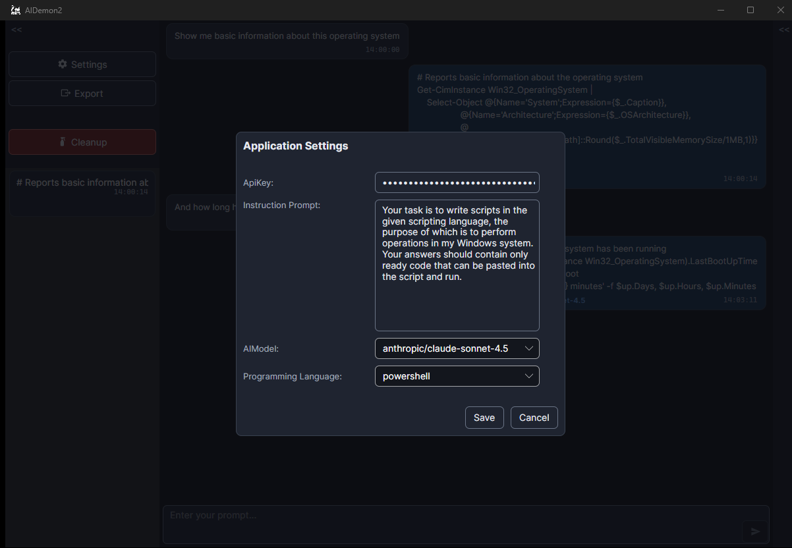

# AIDemon2 - your personal AI assistant


**This application allows to interact with various available AI models and helps write and execute scripts on your computer.**

## About this project

With this app you will be able to quickly communicate with the AI ​​model to prepare a script to be executed on your device.

Thanks to predefined communication instructions and language preferences, you will receive a ready-to-run script that does not require special formatting, copying, pasting, or creating a new file for it. 

Just specify in the message what functionality you expect. The selected AI model will prepare this script in the language you provided and send it back to you in response.

## Prerequisites
AIDemon2 runs on **64-bit Windows 10 or 11**.

The application talks to AI models through **[OpenRouter](https://openrouter.ai)**, a single
API in front of models from many providers — OpenAI, Anthropic, Google, Meta, DeepSeek,
Mistral and others. To use the application, create an account there and generate an API key.

The list of models is fetched from OpenRouter when you open the settings, so it is always
current and does not require an application update when a provider adds or retires a model.

> Upgrading from 1.0.x? Paste a new OpenRouter key **and pick the model again** — io.net
> identifiers do not exist in OpenRouter.

## Supported programming languages

Every language below is verified automatically — on Linux by running each interpreter
inside a container, on Windows by tests that start the real process.

|  |  |  |  |  |  |
|:-------:|:-------:|:-------:|:-------:|:-------:|:-------:|
|  |  |  |  |  |  |
| **Windows · Linux** | **Windows · Linux** | **Windows** | **Windows · Linux** | **Windows · Linux** | **Linux** |

|  |  |  |  |  |  |
|:-------:|:-------:|:-------:|:-------:|:-------:|:-------:|
|  |  |  |  |  |  |
| **Windows · Linux** | **Windows · Linux** | **Windows · Linux** | **Windows · Linux** | **Windows · Linux** | **Windows · Linux** |

`batch` exists only on Windows and `zsh` only on Linux (or WSL); everything else runs on both.
The application says which interpreter it looked for when one is missing, instead of failing
with a raw system error, and it matches line endings to the interpreter — a shell script
written on Windows would otherwise break on every line.

Most interpreters have to be installed separately. Two conveniences worth knowing: `bash`
on Windows is located automatically in Git for Windows or WSL, even though neither is on
`PATH`, and `php` gets its opening `<?php` tag added when the model omits it.

## Application UI


The chat window displays your messages on the left and the model's replies on the right,
each reply labelled with the model that produced it. Below the conversation there is a
field for entering a message and a button for sending it.

### Left panel


Expanded with the button in the top-left corner. It contains:
- **Settings** — opens the settings window
- **Export** — exports the whole conversation to JSON or CSV
- **Cleanup** — clears the history
- the list of saved (favourite) messages

### Message panel


Opened by double-clicking any message. From the left, its buttons are:
- **Save** — adds the message to the favourites list, together with any edits you made
- **Run** — executes the code, after a confirmation prompt; available only for replies from the model
- **Resend** — sends the message again; available only for your own messages
- **Export** — writes the message to a script file with the extension matching its language
- **Remove from favourites** — takes the message off the favourites list and restores its
  original text. It does **not** delete the message: it stays in the conversation
- **Clear** — closes the editor without saving

Below the buttons is the editable message content, and under it the console output shown
when a script is executed.

## Configuration


Once you have generated the key in OpenRouter, paste it into the application settings. The key is masked as you type and is stored in an encrypted database.

If you want the communication with the AI ​​model to proceed on the basis that in the received response you will receive a ready-to-execute script, you must define the content of the instruction that will be sent to the model before sending the actual message from the user. In the Instruction Prompt field, you can freely define the content at your own discretion, an example of the instruction content:

```
Your task is to write scripts in the given scripting language, the purpose of which is to perform operations in my Windows system. Your answers should contain only ready code that can be pasted into the script and run. You are not to provide any confirmations, explanations or anything other than the code you are to write. You can include additional information in comments in the script. In each script, add a short comment at the beginning describing the script.
```

The AIModel field lists the models OpenRouter currently offers. Pick whichever you like — pricing and capabilities differ, so a cheap fast model is fine for simple scripts and a stronger one pays off for complex ones.

If you want the AI ​​to generate scripts, you must specify in which language it should write it. In the Programming Language field, there is a selection list available, you must select the language before starting communication.

## How to use

Once everything is set up, you can start communicating. Just write a message and click 'send'. Depending on the model, you might wait some time for a response. After receiving it, it will be added to the list in the chat window. In the window with the response, you can see the information about which model sent us this response, it will be the same model that you selected in the settings.

After receiving the response, you can open the message by double-clicking on it, which will cause the message editing window to slide out on the right. Here you can correct the code before running it.

Running a script always asks for confirmation first. The code was written by a language model and runs with your own permissions — it can read, change or delete your files, so read it before you agree. A script that does not finish within 30 seconds is terminated together with any processes it started.

Once you confirm, the code is written to a script file and executed. Output appears in the console field as it is produced, so long-running scripts show progress instead of staying blank until they finish.

## Disclaimer
The authors of the solution are not responsible for the quality and content generated by the AI models, and do not take responsibility for the effects of invoking scripts generated by it.

The solution and its authors are in no way affiliated with the owners of the **OpenRouter** platform or with any of the model providers available through it.

For more information on regulations, please see the licensing arrangements.
